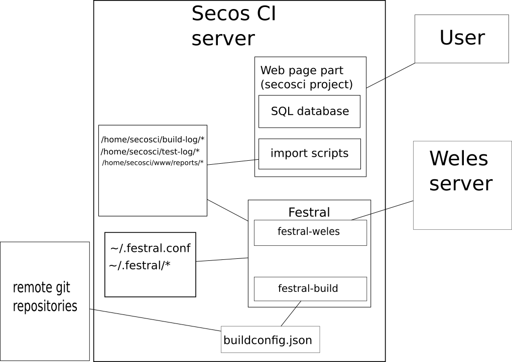

# Festral

This package is developed and adopted for usage with existing extended secos CI system (http://127.0.0.1:81/u.harbuz/secosci) which consists of PHP page, MySQL database and set of scripts for importing
data to the database from the formatted in some way files. This package uses set of configuration files for management of repositories building and testing.

Festral consists of some small utilities:

* `festral build` - utility for building repositories. It takes simple json file with information about what to build, how to build and what branches to build and just do it.
* `festral weles` - utility for communication with Weles tests server.
* `festral boruta` - utility for connecting devices of the farm directly.
* `festral test` - utility for performing tests described by yaml files on remote Weles server and recieving results of the tests.
* `festral server` - simple built-in web server for sharing built files and logs.
* `festral report` - generate reports in various formats

----------
### How to build
Installation scripts presented below are made on Ubuntu 16.04.

`Festral` is written in Haskell and for building it from sources your need to have installed `haskell-platform` package for your distribution:

```
 $ sudo apt install haskell-platform
```

The next step is to install `cabal` package manager which will configure `Festral's` sources, resolve its dependencies, build and install package for you:

```
 $ sudo apt install cabal-install
 $ cabal update
 ```

Now you can build the package. Go to the root directory of the `Festral` sources (it contains Setup.hs file) and run:

```
 $ sudo apt install libghc-curl-dev
```
After installing curl library you can just run `make` command of maki by hands:

```
 $ cabal install --only-dependencies
 $ runhaskell Setup.hs configure --user
 $ runhaskell Setup.hs build
 $ runhaskell Setup.hs install
```

If build finished with success, you will find festral executable in the directory `dist/build/festral/festral-build/festral-build` and `dist/build/festral/festral-weles/festral-weles`

-----------
# Usage
-----------
### festral

Since **v.0.6.0** version all subutilities was unified in subcommands in one `festral` command. You can get information about it by typing `festral --help`.
Avaible commands are: `build`, `weles`, `test`, `server`.

### HTML reporting

There is also option `--html-report` available without any command which generates HTML summary report about latest builds and tests and put it into stdout or into file specified by -f option.
The simple templating mechanism for HTML is available: you can put in your own HTML file `##TEMPLATE_BUILD_TABLE tableId##` row and it will be replaced by HTML table of build results, and
`##TEMPLATE_TEST_TABLE tableId##` for inserting table with test results. Parameter `tableId` is the html node id, this table will be accessible by it from html/css/javascript files.
There is example of such page template and JavaScript for it in `Examples/reports/`.

### configuration

Also since **v0.6.0** version whole program is configured by file `~/.festral.conf` formatted as below (see example at `Examples/config.json`):
Since **v.0.8.0** field `reportsDir` was renamed to `serverRoot` so **YOU MUST CHANGE YOUR CONFIG after update to the v.0.8 from previous versions**.

```
{
    "buildLogDir" : "/diretory/for/builds",
    "testLogDir" : "/directory/for/tests",
    "welesIP" : "127.0.0.1",
    "welesPort" : 5010,
    "welesFilePort" : 8888,
    "festralIP" : "your machine IP",
    "festralPort" : 8888,
    "serverRoot" : "/root/directory/for/your/fileserver",
    "borutaIP" : "127.0.0.1",
    "borutaPort" : 6666
}
```
This configuration file was separated from tests descriptions (see `festral test` section).

Other commands are described below:

### festral build

This command clone and build all targets listed in configuration json file: each target is built for every branch listed for this target.

The `festral build` utility has simple command format:

```
 $ festral build (-c <config json>) (-r <repositories location>) (-o <output directory>)
```

The main part of these arguments is `config json` which contains description of build targets.
It has format described below (see example of this file in `Examples/buildconfig.json`):

```
 [
    {
        # Name of the repository, remote repository will be cloned to the directory with this name under <repositories location>
        "buildName" : "tct-test-ta",
        # Command to be used for build this repository
        "buildCmd" : "gbs build -A armv7l -P tizen_vd",
        # remote address of the repository to build.
        "buildRepo" : "git@127.0.0.1:l.kostyra/tct-test-ta.git",
        # Name of the parser of the build results. See description below.
        "buildResParser" : "GBS",
        # List of the branches to be built. Every one from these will be built for the target.
        "branches" : ["master", "arm", "devel"]
    },
    { ... Some other build targets ... }
 ]
```

Parser is some script or binary which generates meta.txt file from output of your `buildCmd` command.

`meta.txt` file has format:

```
 BOARD=#name of the board or arch of target
 BUILD_TYPE=#debug or somthing else, I don't know for what it is
 COMMIT=#name of the built commit
 BUILD_TIME=#build time in format YYYYMMDDHHMMSS
 TOOLCHAIN=#name of toolchain used for build
 BUILDER=#username of builder
 BUILD_STATUS=#result of build (SUCCEED and FAILED are known, but may be there are other ones)
 BUILD_HASH=#hash of the build
 REPO_NAME=#name of the built repository
 BRANCH=#name of the built branch

 #In the tests directories meta.txt has additional fields:
 TESTER=#login of the tester
 TESTER_NAME=#name of the tester
 TEST_TIME=#time where test was performed
 TEST_NAME=#name of the test
 TEST_STATUS=#Status of the executed tests. See below for possible values.
```

Parser script MUST gets output of the `buildCmd` from its `stdin` after start and writes meta file to the `stdout`.

`repository location` is path where directories cloned from `buildRepo`'s of targets projects will be put.

`output directory` is directory where builds results will be put in format 'commithash_buildtime'

After running this command program will do:

  1. clone all repository listed in `config json` to the subdirectory of `repositories location`
  2. checkout for each branch listed in `config json` for current repository and run specified in config build command
  3. pass standard output of build command to the parser specified in the config for this repository
  4. create `meta.txt` file from parsed build output
  5. create directory named as `commitSha1Hash_buildtime` in the `output directory` and put here `meta.txt`, raw build log as `build.log` file
  6. create subdirectory `build_res` and move here all files from parsed `OUT_DIR` meta field
  7. add name of build directory to the `~/.festral/fresh_builds` file and update `~/.festral/build.cache` file by new out files.

Currently possible statuses for `TEST_STATUS`:
  - `BUILD FAILED` - test was not started because repository under test has not built successfully.
  - `YAML NOT FOUND` - YAML file from test config for this repository does not exist
  - `NO JOB STARTED` - Weles job has not been started because some error occured
  - `DEVICE FAILED` - Device Under Test (DUT) was failed what means that communication between Mux-Pi and DUT was lost or command executed on DUT exit with fatal error or some other problems appeared on tested board.
  - `DOWNLOAD FILES ERROR` - failed to download all artifacts by Weles server: it usually means that one of the URI appeared in YAML file is invalid or that there is no free space on the Weles server.
  - `WELES ERROR` - test job failed with some other error: error message is in log file
  - `SEGFAULT` - `segmentation fault` error was appeared during testing process, so pass/all test rating can be not complete
  - `COMPLETE` - test executed on Dryad with no errors. **It doesn't mean that tests passed successfully**, for see test results see test output generated by test parser (see `festral test`).

--------------
### festral weles

The `festral weles` is utility for communication with remote Weles server.

You can get help about this program by calling:

```
 $ festral weles --help

```

For starting single test use
```
 $ festral weles -s yaml_file.yml
```
This command writes id of the new job to the console, which you can pass to the -i option and get information about job. For example:
```
 $ festral weles -i 112233
```
will show status of job with id 112233,
```
 $ festral weles -i 112233 --job-stdout
```
will print standard output of the test job
```
 $ festral weles -i 112233 --list-files -f test12348.txt
```
will print content of the file owned by Weles with name test12348.txt if it is in the artefactorium of this job.

To see list of files use
```
 $ festral weles -i 112233 --list-files
```
------------------
### festral boruta

The `festral boruta` is tool for connecting to devices registered in the Boruta's farm of SLAV stack. This tool is more low-lewel then even `festral weles`, but it could
be helpful when you need to have console for device under test and its MuxPi.

You can get list of all workers (devices) by calling
```
festral boruta -w
```

Now devices are identified by its `device_type` field of the output JSON, so if you are want to have onsole for e.g. some `kantM1` board, you can 
get it by command
```
 $ festral boruta --console-device kantM1
```
This command will open ssh session which will be **valid not more than 1 hour** for one of the running boards of that type. If no running boards are present, this command will send 
new request for start this target. This method is bad because you couldn't use this device by UUID during this session.

list all requests and statuses of Boruta:
```
 $ festral boruta -a
```
Open ssh console for  MuxPi specified by its UUID (you can find it in list of workers, see festral boruta -w):
```
 $ festral boruta --console-uuid 355e0604-7832-4c21-948c-86c55989118f
```
Push file ~/file_from from host to the MuxPi as /tmp/test.json with UUID:
```
 $ festral boruta -u 355e0604-7832-4c21-948c-86c55989118f --push ~/file_from -o /tmp/test.json
```
Push file ~/file_from from host to the device under test directly (e.g. for Raspberry Pi3 connected to this MuxPi) as /tmp/test.json with UUID:
```
 $ festral boruta -u 355e0604-7832-4c21-948c-86c55989118f --push ~/file_from -o /tmp/test.json --dut
```
Boot device up:
```
 $ festral boruta --boot 355e0604-7832-4c21-948c-86c55989118f
```
Execute command uname -a on device under test:
```
 $ festral boruta -u 355e0604-7832-4c21-948c-86c55989118f --exec "uname -a" --dut
```

------------------
### festral test

`festral test` is used for runnig tests on Weles from existing builds and and put it to the directory defined in `~/.festral.conf` configuration file.

It has syntax:

```
Usage: festral test (-r|--run-test TEST_CONFIG_FILE) [-b|--with-build BUILD_DIR]
  Create jobs on remote Weles server with tests defined in .yaml files and
  process responces with results of its execution.

Available options:
  -r,--run-test TEST_CONFIG_FILE
                           Run tests listed in TEST_CONFIG_FILE for specified by
                           -f option build directory. Run for all targets listed
                           in '~/.fresh_builds' file if no target specified.
  -b,--with-build BUILD_DIR
                           Run test only for this build if defined
  -h,--help                Show this help text

```

It is configured by  file passed with -r parameter which is in JSON format with fields as follow:

```
[
        {
            "repo" : "name of the repository",
            "yaml" : "path to the yaml file to use with this repository",
            "name" : "Test name (this is optional field, defoult value is 'undefined')",
            "parser" : "name or path to the binary of the parser of tests output"
        },
        {
            "repo" : "gpapi-tests",
            "yaml" : "/home/tf.yml - example",
            "parser" : "cat"
        }
]
```

Supported built-in test parsers currently are only "TCT" - for tct-test-ta and "XTest" - for xtest made by OPTEE.

You can create own parser scripts for festral-weles. Such script **MUST get log with test result as its** `stdin` **and put parsed statistics to the stdout**.

Parsed data has format:

```
######################################

Test name,test id, testcase name,result of preparing for test,result of test,result of cleaning after test,spent time

...

######################################
```

Result of test can be TEST_PASS or TEST_FAIL.

Example of such output:

```
###########################################################
Xtest,0,regression_1001,TEST_PASS,TEST_PASS,TEST_PASS,0.0
Xtest,1,regression_1002,TEST_PASS,TEST_PASS,TEST_PASS,0.0
Xtest,2,regression_1003,TEST_FAIL,TEST_FAIL,TEST_FAIL,0.0
Xtest,3,regression_1004.1,TEST_FAIL,TEST_FAIL,TEST_FAIL,0.0
Xtest,4,regression_1004.2,TEST_FAIL,TEST_FAIL,TEST_FAIL,0.0
Xtest,5,regression_1004.3,TEST_FAIL,TEST_FAIL,TEST_FAIL,0.0
Xtest,21,regression_1010.1,TEST_PASS,TEST_PASS,TEST_PASS,0.0
Xtest,22,regression_1010.2,TEST_PASS,TEST_PASS,TEST_PASS,0.0
Xtest,23,regression_1010.3,TEST_PASS,TEST_PASS,TEST_PASS,0.0
Xtest,24,regression_1010.4,TEST_PASS,TEST_PASS,TEST_PASS,0.0
Xtest,25,regression_1010.5,TEST_PASS,TEST_PASS,TEST_PASS,0.0
###########################################################
```

Example of the bash script for parsing XTest is at `Examples/own_xtest_parser.sh`

When you run `festral test` command, it will do actions:

  1. read every record in `TEST_CONFIG_FILE` and go to the properly build directory
  2. read YAML template specified in config for this test and make really YAML file from it: find existing packages listed in `~/.festral/build.cache`
  and replace templated names with it, get field `webPageIP` form `~/.festral.conf` file and create uri for downloading packages from this IP using format:

  http://`webPageIP`/secosci/download.php?file=`resolved_package_name`&build=`resolved_build_dir_name`/build_res

  so there is `download.php` script must exists under `webPageIP` adress and it must accept parameters `file` and `build`.

  3. send this yaml for the Weles server and wait for an 1 hour for test finishes, if not, cancel this mjob and run next test
  4. if test finished, pass output of test to the specified in config parser.

  **If it is built-in parser,** only `tct-test-ta.log` is passed for **TCT** parser
  and only `xtest.log` is passed for **XTest** parser, So **YOU MUST REDIRECT THESE TEST OUTPUTS TO THE RIGHT FILES IN YOUR YAML FILE**.

  If you yse your own parser, all output files from server will be passed to the test results parser

  5. create directory named as `buildCommitSha1Hash_testTime` in the directory specified in `testLogDir` field of the `~/.festral.conf` file
  and put here files: `build.log` - meta file from tested build; `meta.txt` - extended meta file with additional informations about testing
  `report.txt` - parsed test results; `tf.log` - whole output of the test process

  6. put names of new test logs to the `~/.festral/fresh_tests`

----------------
### festral server
This commant is used for setting up simple web server which can be used for sharing built files with remote Weles server of just show logs and reports in the web browser.

The syntax of this command is simple:
```
festral server -p PORT_NUMBER
```
where PORT_NUMBER is just number of port where server will listen to.

Web pages of this server have API as follow:

  * `/secosci/reports[.php]` - page with listed reports files
  * `/secosci/reports[.php]?file=filename` - show specified by filename report
  * `/secosci/getlog[.php]?type=type&hash=hash&time=time` - show log specified by type: it can be `build` for build log and `test` for test log.Log also must be specified by hash and time of the build/test.
  * `/secosci/download[.php]?file=filename&build=build_dir` - link for downloading of the file with `filename` from the build directory specified by `build_dir` parameter

-----------------
### Test cases description

Tests are described by YAML files used by `Weles` but extended with templates syntax (see examles at `Examples/*.yml`)

You can use templated rows in your yamls according below syntax:

* temlate fragment starts and finishes with `##` symbols.
* `##TEMPLATE_URL filename##` - replace given filename with `uri` for the file with specified name (or if specified filename is part of the real filename)
    from the current build only. If no such file made by the current build this link can be invalid.

    Example: `##TEMPLATE_URL tef-libteec##` can be replaced by row
    `uri: 'http://127.0.0.1/secosci/download.php?file=tef-libteec-0.0.1-0.armv7l.rpm&build=c2ac26bd548e04ddd5ef5150f600172048f2fcfa_20180622210245/build_res'`
    and `Weles` will can download this package by generated link.
* `##TEMPLATE_LATEST packagename##` - replace given filename with uri to the latest built version of the specified package if it ever been built by the `Festral`.

    Example: `##TEMPLATE_LATEST tf##` can be replaced with `uri: 'http://127.0.0.1/secosci/download.php?file=tf-0.0.1-0.armv7l.rpm&build=c2ac26bd548e04ddd5ef5150f600172048f2fcfa_20180622210245/build_res'`.
    You can push packages from other repositories built by `festral-build` to the `Weles` using this template.
* `##TEMPLATE_RPM_INSTALL_CURRENT packagename##` - install package specified by name on target using `rpm`. It is more generic replacement for

```
- push:
    ##TEMPLATE_URL packagename##
    dest: '/tmp/packagename.rpm'
    alias: 'packagename.rpm'
- run:
    name: "'rpm -i /tmp/packagename.rpm --force 2>&1 >> /tmp/install.log'"
```

* `##TEMPLATE_RPM_INSTALL_LATEST packagename##` - same as `##TEMPLATE_RPM_INSTALL_CURRENT packagename##` but use `##TEMPLATE_LATEST name##` instead of `##TEMPLATE_URL name##`.
* `##TEMPLATE_FILE filename##` - insert into this place content of the file specified by `filename`. It allows separate similar parts of the yamls by files for ommiting repeating of code.

------------------

### How it works

This package is developed for using with [Weles API for device farm](https://git.tizen.org/cgit/tools/weles/) and modified [SecosCI system](http://127.0.0.1:81/u.harbuz/festral/tree/master) (optional).
It uses API of `SecosCI` for generated output (except HTML reports) and remote device farm for performing tests.


.


The typical usage example for automated running tests with `cron`:

```
0 21 * * * ./bin/festral build -c /home/secosci/bin/festral-build.config.json -r /home/secosci/secos-repo/
0 0 * * * ./bin/festral test -r /home/secosci/bin/festral-test.config.json
0 2 * * * ./bin/festral --html-report -o /home/secosci/www/reports/$(date +\%Y\%m\%d\%H\%M).html -f /home/secosci/www/template.html
```

Steps which are executed:

1. building repositories listed in `buildconfig.json` by `festral-build`
2. running tests for new builds on `Weles` by `festral-weles`
3. generate summary HTML report

